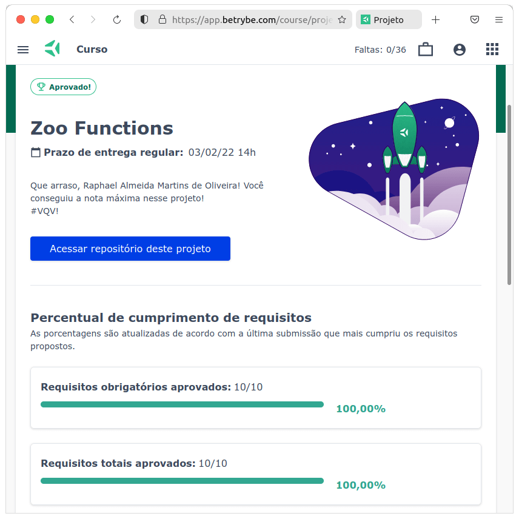

# :globe_with_meridians: Zoo Functions :globe_with_meridians:

## :page_with_curl: About

JavaScript project developed by me ([Raphael Martins](https://www.linkedin.com/in/raphaelameidamartins/)) at the end of the Unit 8 Module 1 of the [Trybe](https://www.betrybe.com)'s Web Development course. I was approved with 100% of the mandatory and optional requirements met.

We had to solve programming logic, and object/array manipulation challenges by using ES6 features such as **HOFs**, **arrow functions**, **array/object destructuring**, **spread operator**, **rest parameter** and more.

## :hammer_and_wrench: Tools

* JavaScript ES6+

## :trophy: Grade

### :copyright: Copyright disclaimer

I developed this project for learning purposes, all the code and documentation texts in Portuguese and English are my authorship, except the ones that were already implemented and are marked with comments in the files. And the rights belong exclusively to me. It is allowed to download or clone the repository for study purposes. However, it is not allowed to publish full or partial copies. This disclaimer does not cover libraries and dependencies, which are subject to their respective licenses.
